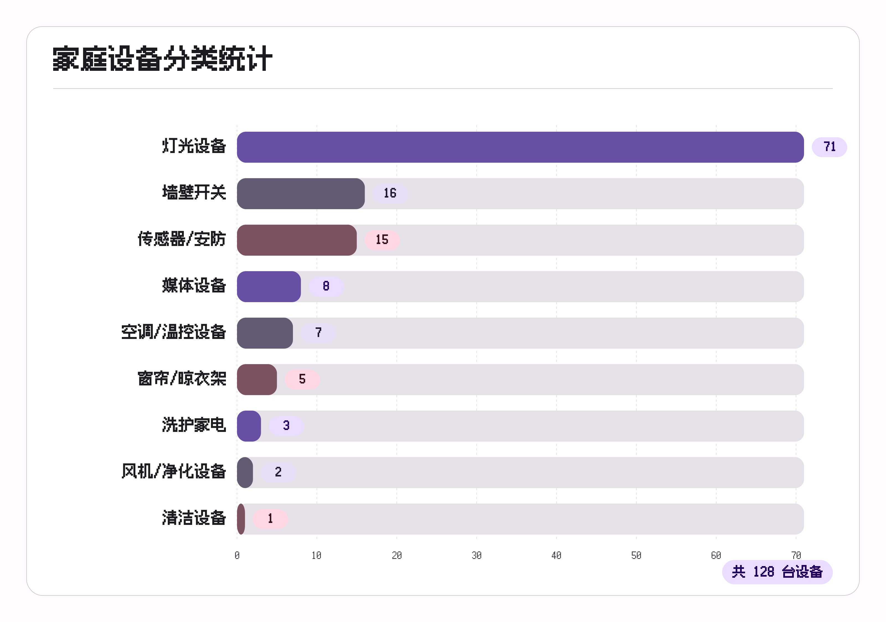
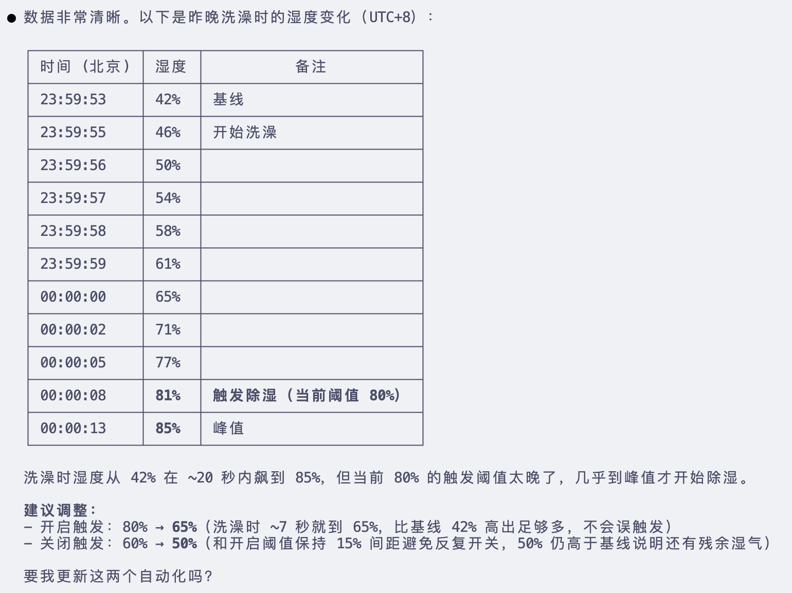
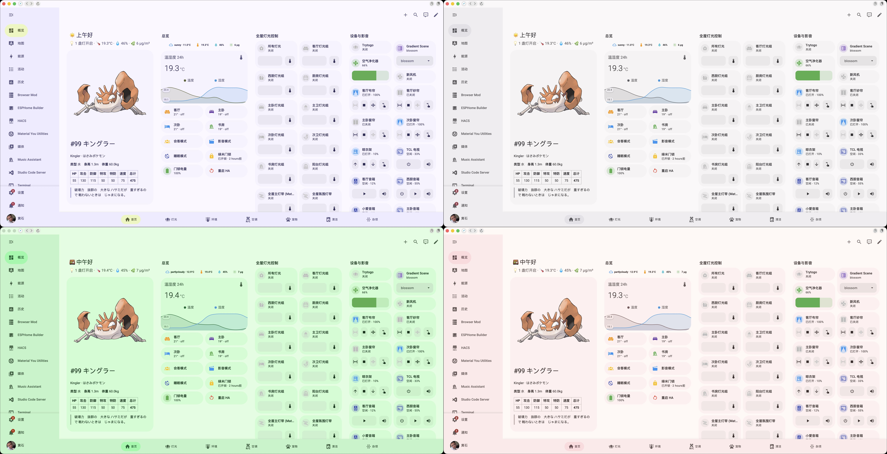
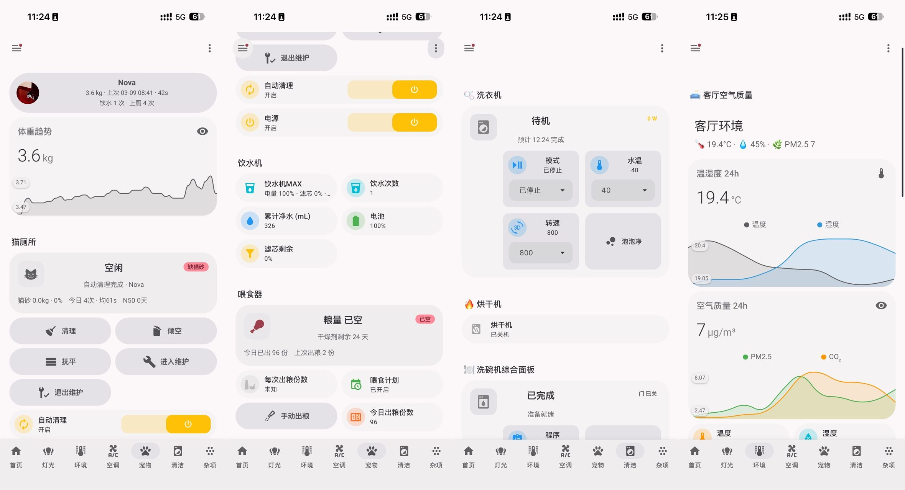

# 打造我的「智能家」——使用 Claude Code 轻松使用 Home Assistant

作为一个 Home Assistant 的长期用户，我一直有个梦想就是在新家实现尽可能所有设备的智能化。之前其实分享过[部分方案](https://sspai.com/post/79141)，不得不说 HA 的是有一定上手门槛的，另外长期使用存在一些难题：

1. 使用 YAML 配置维护容易变得**非常冗长**，写配置/维护服务的十分消耗时间和精力（尽管有点乐此不疲）；使用 UI 维护非常低效和不体面
2. 设备一多，**维度难度也开始陡增**，实体 id 变得眼花缭乱，得人工查各个文档
3. 基本**无法进行有效的版本管理**

但是 **Agentic 时代这些都不再是问题**。

搬新家的时候，我**从 0 用 Claude Code 搓了一整套 Home Assitant 配置**，包括场景、自动化、批量配置、前端界面美化，用极少的人工界入实现了我心目中理想的「智能家」。

## 核心理念和使用

**用 Python 脚本通过 HA API 来控制部署的整个流程**。有兴趣的可以阅读 Claude Code 自己写的文档。

这样做的好处是**不用修改冗长的 YAML 文件增添 Agent 上下文负担**，比如我要修改所有的灯的上电状态为记忆，实际上是一个 `setup_power_on_state.py` 的脚本，用 `for` 循环遍历了所有灯设置的。而如果使用 YAML 文件需要阅读和更改所有的实体的配置。

整体项目开源在 https://github.com/yzlnew/ha-config-as-code。直接 clone 之后使用 Claude Code 打开就可以，已经包含 skills 和项目的 `CLAUDE.md`，直接开始对话说你的需求即可。比如：

> 连接到我的 HA 实例，列出所有设备和实体，输出一份设备清单让我确认。我的 HA 地址是 http://x.x.x.x:8123，token 是 xxx。

## 模型和 skills

我主要是使用 Opus 4.6 实现，不过结合仓库中已有知识其他模型理论上来说也会有不错的效果，另外仓库中的还有`home-assistant-manager`（HA API 维护的基础知识，不过由于 `hass-cli` 已经常年失修并且不可使用，已经移除） 和 `interface-design`（交互设计指南）两个 skill 可以使用。

## 配置思路

在智能设备上，基本是能智能化的设备都选择了智能化，并且提前调研了是否能顺畅得接入 HA。可能会准备一篇新的文章来分享选购思路和使用体验，本文中会忽略这些细节。

### 首先要有光

由于无主灯，灯我就买了大概 60+ 设备。包括主要是射灯和灯带。我主要选用了 matter 和米家平台的灯具。如果要我现在选的话，**更推荐大家使用米家 mesh 2.0 的灯具**，连接和配置都更加简单。matter 灯具需要额外配置局域网的 iPv6，通过 Apple Home 的控制器接入到 HA 中。而米家的灯具首先可以批量接入到米家中，不用手动扫码一个个加入 Apple Home，然后直接通过小米官方集成就可以接入 HA。另外米家的灯普遍价格要比 matter 白牌的灯**便宜一半左右**。

接入到米家的时候需要手动设置房间名称，然后到 HA 会带上米家的房间信息。之后就是配置灯组（`create_groups.py`）。我的逻辑是：

1. 房间的灯成组，比如客厅灯光、主卧灯光
2. 主灯带（24V，matter 控制器）和氛围灯带（12V，米家控制器）成组，用来控制照明和氛围

可以自行和 Claude Code 沟通成组逻辑，灯组可以有效简化后续的**绑定智能开关、语音控制**。

另外我取消了 Apple Home 和米家灯具所有的自适应照明（节律照明）功能，**统一使用 [Adaptive Lighting](https://github.com/basnijholt/adaptive-lighting) 配置**（`setup_adaptive_lighting.py`）。其中卫生间会配置**偏冷**、公共区域**中性**、卧室**偏暖**的自适应照明方案。

最后是批量设置了上电状态为**记忆**而不是开启（`setup_power_on_state.py`）。

### 场景设置

除了区域灯光的自适应照明，另一个高频需求就是照明的场景。我给家里配置了三个场景：

1. **会客模式**：公共区域提高亮度和色温，适合朋友聚会
2. **影音模式**：背景墙灯带调低亮度，关闭其他公共区域的灯光
3. **睡眠模式**：关闭卧室的灯

同样如果要设计其他模式，可以直接和 Claude Code 沟通，它根据你的情况会主动询问你的具体需求，在使用一段时间之后，可以这样对话：

> 查看我近期的日志，有什么合适的场景或者自动化可以推荐给我吗？

### 按键绑定

我家全都买的**小米的智能开关**，可靠、有无零线均适配、价格合适。搭配智能灯使用，需要全部设置成**无线模式**（`setup_wireless_switches.py`）。因为是同品牌的开关，Claude Code 很容易过滤出设备列表并结合房间信息进行按键绑定。并且让它设计了**统一的绑定方案**，比如左键单击是切换对应区域的灯光等等。为了防止遗忘和客人使用，同样生成了一份 **HTML 格式适合打印的使用文档**。

## 自动化和控制

自动化可以说是**智能家居的核心**。然而在这些 Agent 工具之前，我们得花很长时间构思、配置自动化，使用 YAML 配置要小心翼翼测试、使用 UI 配置非常繁琐。而现在我可以像个真正的老板一样，说出自己的需求，Claude Code 能够**生成可靠的自动化，甚至从设备列表、使用习惯推荐自动化方案**。

为此，仓库中维护了一个 `TODO.md` 来记录和实现这些构思。其中比较重要的有：

1. **人在亮灯**：人在传感器我主要有两类，一个是领普的人在筒射灯，便宜、但是无人判定时间长、容易误触发；另一类是顶装的独立的人在传感器。这些自动化我都通过 HA 实现，而不用米家中点按或者灯自带。并且只在厨房、卫生间等非公共区域使用。
2. **浸水报警**：厨下有水浸传感器，有警报之后会通知我的手机，并且家里有一盏特殊的装饰灯，如果家里有人会**闪红光**。
3. **完成通知**：洗衣机/烘干机/洗碗机运行结束之后会发通知，并用 **HomePod 语音播报**。
4. **宠物通知**：之前文章中废了好大力气设置的猫的如厕通知、喝水通知、缺猫砂通知、垃圾箱已满通知都用 Claude Code **one-shot 完成**，并且会列把购买猫砂和清理待办列表中。
5. **回家模式**：这里比较特殊的是，是通过 HA 暴露了 `在家确认` 这个虚拟开关给 Apple Home，然后通过 iPhone 的离家、回家来触发虚拟开关，并配合门锁打开来实现，这样可以**不用在后台运行 HA app**，更省电和可靠。
6. **自动排气**：坐上马桶之后会自动开始浴霸排风，并且离开之后几分钟之后停止。
7. **自动除湿**：检测到浴室湿度高于一定值之后，开启排气，一直到低于设定阈值之后停止。

其中可以参考如何和 Claude Code 沟通的迭代的方式，在这里**不需要一步到位**，可以在使用中让 Claude Code 自动发现规律，比如这个除湿阈值的设置，是从我某次洗澡中自动获取和配置的

语音控制上，我主要是通过 HomePod，所以把所有非 Matter 设备通过 Home Bridge 透给了 Apple Home（`setup_homekit.py`）。省去了大量筛选实体的时间。Apple Home 的区域分组也是和米家保持一致。如果想要通过小爱控制所有的 HA 设备也很简单，大致就是：

> 我希望通过小爱同学控制所有的设备，设置自动化获取小爱音箱的语音识别文本，匹配到设备控制并注意阻止小爱音箱自己的语音回复。

## Dashboard 和美化

之前使用 HA 的一部分乐趣和痛点就是前端了，很想搞一个很好看的 Dashboard 但是又前端乏力。然而现在这些模型的前端能力都相当可靠，甚至审美超前。经过一番迭代，我是用 **Material Design 3** 风格构建了整个 Dashboard。整体迭代其实并没有看起来简单，尤其是我是用了 **Gemini 3 Pro** 生成风格、**Opus 4.6** 修改排版、**Codex 3.5** 继续优化，以及哪个有用量就用哪个顶上，逐步迭代出自己想要的样式。

最常见的按键会放在首页，方便直接在墙上的小米平板 5 作为 Wall Panel 进行控制。其余的按照功能分区到灯光、环境、宠物等等子 tab。卡片基本使用了 Mushroom，并且使用 Custom Card 来实现一些复杂的聚合类设备的状态显示和控制需求，比如洗碗机、洗衣机等。

在各种交互中，还是感受到 Opus 4.6 是一个与众不同的模型，有更好的理解能力和排版功底，可以减少返工次数。工具上的体验基本是属于 **Claude Code >= Codex >>> Gemini Cli**。

## 其他亮点功能

### 每日宝可梦

为了增添 Dashboard 的趣味性，增加了一个每日宝可梦的展示，通过 PokeAPI 每天获取一个随机宝可梦进行展示。并且这个宝可梦的图片会自动设置为 `Material You Base Color Source Image Path/URL` 进行 Material You 主题自动取色。

### 电子墨水屏

通过 ESPHome 接入了一块电子墨水屏，进行 HA 数据的展示。特别的地方是会有一个 Claude Code 用量的展示，这部分是通过装了 Claude Code 的机器通过 API push 用量信息到 HA（`push_claude_usage.sh`），再通过墨水屏进行展示。这个墨水屏套件的价格还是有点贵，不过是一个非常适合用来做 demo 和学习的东西。壳子是商家提供的 3D 打印模型。

## 感想：在全自动和可控性之间

从去年底到现在，可以说以 OpenClaw 代表的 Agent 席卷全球，甚至出现比较搞笑的「上门安装」OpenClaw 需求热潮。网上也有不少关于使用 LLM 来控制智能家居、接入 HA 的案例。但是我们生活中，其实更多是重复的范式，但是挖掘和实现自动化需求在 Claude Code 出现之前对于一般人是比较困难的。通过 Claude Code 生成可复用的自动化脚本，让我更体会到智能家居的乐趣。不用查文档、更不用低效地拖节点，**所想即所得**。在 2026 我将不再推荐诸如米家极客版、n8n 或者 Node-RED 的方案，Home Assistant 凭借其强大、丰富、开放的 API 工具，必将成为这个 **Agentic 时代智能家居的第一选择**。