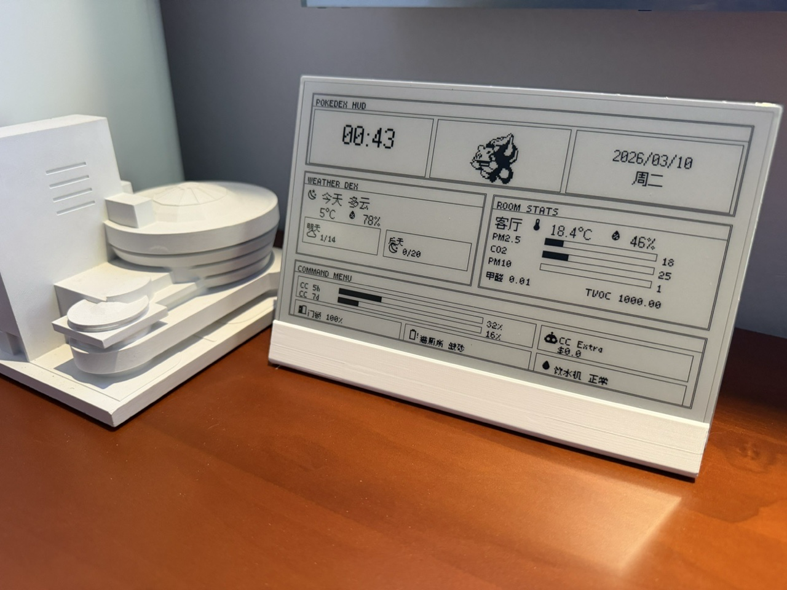

# Building My Smart Home from Scratch with Claude Code + Home Assistant

As a long-time HA user, I recently moved into a new home and decided to set up **everything from zero using Claude Code as my primary tool**. The result: scenes, automations, batch device configuration, and a polished dashboard — all with minimal manual intervention.

The whole project is open-sourced at **[ha-config-as-code](https://github.com/yzlnew/ha-config-as-code)**. Clone it, open with Claude Code, and start chatting about your needs. It includes project context (`CLAUDE.md`) and custom skills out of the box.

## Core Idea: Config as Code via HA API

Instead of editing lengthy YAML files, I use **Python scripts that talk to the HA REST/WebSocket API** to manage everything. For example, setting all 60+ lights to "last state" on power-on is a single `setup_power_on_state.py` script with a `for` loop — not dozens of YAML entity edits.

This approach also means the AI agent doesn't need to parse massive YAML files as context. Each task is a self-contained script.

## What I Built

### Lighting (60+ devices, Matter + Xiaomi)

- **Light groups** by room and by function (task lighting vs. ambient strips) via `create_groups.py`
- **Adaptive Lighting** across the house (`setup_adaptive_lighting.py`): cool for bathrooms, neutral for common areas, warm for bedrooms — replacing all native circadian lighting features
- **Batch power-on state** set to "last state" (`setup_power_on_state.py`)

### Scenes

Three main scenes, all generated through conversation with Claude Code:

1. **Guest Mode** — brighter, cooler light in common areas
2. **Theater Mode** — dim the accent strips, turn off other lights
3. **Sleep Mode** — lights off in bedrooms

You can also ask Claude Code to **analyze your recent logs and suggest new scenes/automations**.

### Switch Bindings

All smart switches set to wireless mode (`setup_wireless_switches.py`), with a **unified binding scheme** (e.g., left single-press toggles room lights). Claude Code also generated a **printable HTML manual** for family and guests.

## Automations

This is where Claude Code truly shines. I describe what I want in natural language, and it generates reliable automations — sometimes even **proactively suggesting automations** based on my device inventory and usage patterns.

Key automations:

- **Presence-based lighting** — occupancy sensors in kitchen/bathroom trigger lights via HA (not vendor apps)
- **Water leak alert** — kitchen sensor triggers phone notification + a decorative lamp flashes red
- **Appliance done notifications** — washer/dryer/dishwasher completion announced via HomePod TTS
- **Pet monitoring** — cat litter box usage, water intake, low litter alerts, full waste bin alerts — all **one-shot prompted**, with shopping reminders added to a to-do list
- **Arrival mode** — a virtual switch exposed to Apple Home, triggered by iPhone geofencing + door lock, so **no need to run the HA app in background**
- **Auto ventilation** — bathroom fan starts on toilet occupancy, stops a few minutes after leaving
- **Auto dehumidification** — fan runs when bathroom humidity exceeds threshold, stops when it drops below. The threshold was **automatically calibrated from actual shower data**.

### Iterative Workflow

You don't need to get everything right in one shot. I iteratively refine automations by chatting with Claude Code. For example, the dehumidification threshold was tuned by asking it to analyze humidity data from an actual shower session.

## Dashboard: Material Design 3

Built a **Material Design 3** themed dashboard using Mushroom cards and custom cards. Frequently used controls on the home tab (for a wall-mounted tablet), with sub-tabs for lighting, climate, pets, etc.

### Fun Addition: Daily Pokémon

A random Pokémon fetched daily via PokéAPI, displayed on the dashboard. Its image is used as the **Material You base color source** for automatic theme color extraction.

### E-ink Display

An ESPHome-connected e-ink display showing HA sensor data — including a Claude Code usage dashboard pushed from my dev machine via API.

## Takeaway

There are many approaches to AI + smart home (voice assistants as LLM front-ends, Node-RED, n8n, etc.). What makes the Claude Code + HA API approach different is that it produces **reusable, version-controlled scripts** rather than one-off voice commands or visual flows. You describe what you want, and get a working automation — no documentation hunting, no dragging nodes.

Home Assistant's powerful and open API makes it the ideal platform for this agentic workflow. If you're comfortable with a CLI tool and want to try a fundamentally different way to manage your smart home, give it a shot:

**GitHub: [yzlnew/ha-config-as-code](https://github.com/yzlnew/ha-config-as-code)**

Happy to answer any questions!
